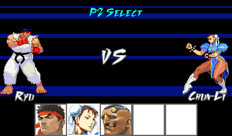

Sidewalk-Champion
=================
A customizable fighting game written with Python and the PyGame library.

## Features
* A fighting game engine modelled after classic 2D fighters, such as Street Fighter 3.
* Simple and intuitive GUI tools for creating characters, stages, and projectiles.
* Cross-platform performance.

## License
See [UNLICENSE.txt](UNLICENSE.txt).

## Dependencies
* Python 2.7
* PyGame
* lxml

## How to Contribute
As we still have a long road of development ahead of us, contributions of any kind will (usually) be accepted with open arms. Simply fork the project over, make your edits, and send us a pull request.

Please note that we use the [Google Python Style Guide](https://google-styleguide.googlecode.com/svn/trunk/pyguide.html) for writing documentation. I won't (and can't) force you to comply to those guidelines, but if you don't you'll probably receive a bit of nagging for your dissidence.
